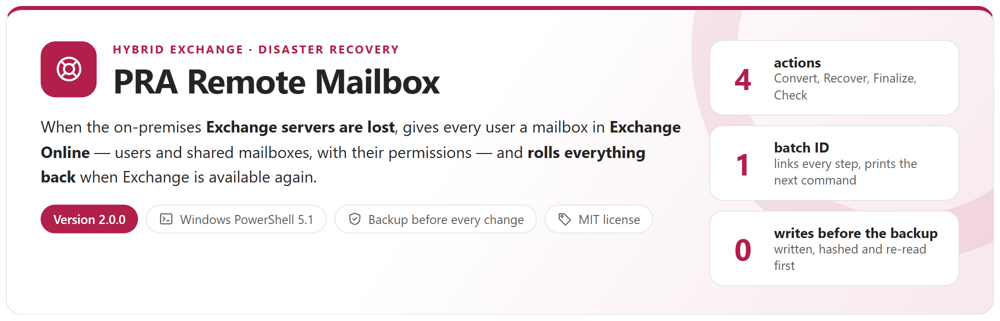
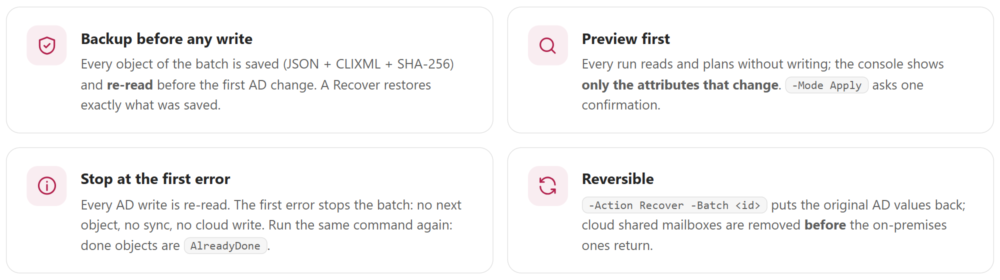
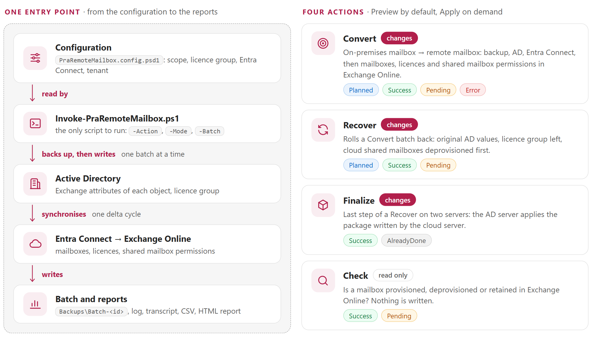
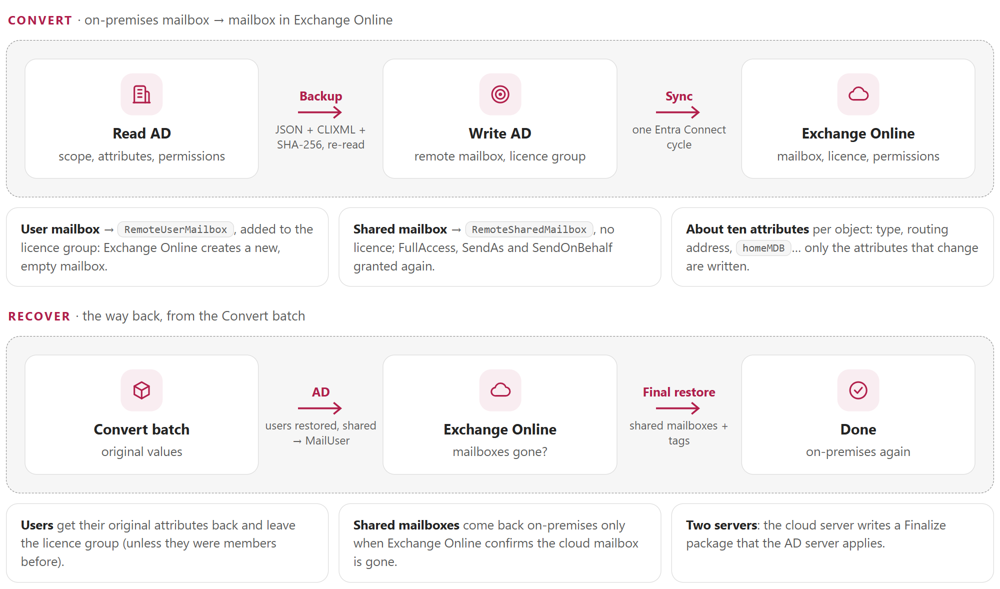
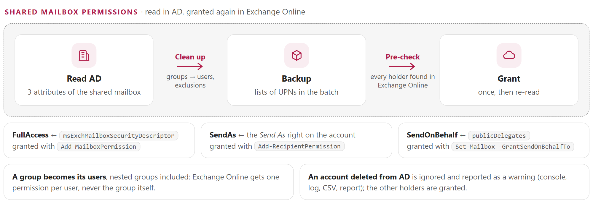

<p align="center">
  <picture>
    <source media="(prefers-color-scheme: dark)" srcset="docs/images/readme-banner-dark.png">
    
  </picture>
</p>

<p align="center">
  <a href="#how-it-works"><b>How it works</b></a> &nbsp;&middot;&nbsp;
  <a href="#convert-and-recover"><b>Convert and Recover</b></a> &nbsp;&middot;&nbsp;
  <a href="#shared-mailbox-permissions"><b>Shared mailboxes</b></a> &nbsp;&middot;&nbsp;
  <a href="#reports"><b>Reports</b></a> &nbsp;&middot;&nbsp;
  <a href="#quick-start"><b>Quick start</b></a> &nbsp;&middot;&nbsp;
  <a href="docs/PraRemoteMailbox-Guide.md"><b>Administrator guide</b></a>
</p>

## Why

In a hybrid organisation, a mailbox hosted on-premises is only a *mail user* for Exchange Online. If the on-premises Exchange servers are lost (ransomware, site loss, corrupted databases), these users have no mailbox at all — and a normal migration is impossible, because moving a mailbox needs the on-premises servers. As long as **Active Directory and Entra Connect** still work, the fastest way back to e-mail is to give each user a **new, empty mailbox in Exchange Online** and to recreate the access to the shared mailboxes. *PRA* stands for *Plan de Reprise d'Activité*, the disaster recovery plan.

Done by hand, this means rewriting about ten Exchange attributes per object in Active Directory, for hundreds of objects, under stress — and keeping every original value to come back later: a wrong or lost value cannot be repaired without a backup. This tool does the conversion in a planned, verified and **reversible** way.

<picture>
  <source media="(prefers-color-scheme: dark)" srcset="docs/images/readme-principles-dark.png">
  
</picture>

## How it works

<picture>
  <source media="(prefers-color-scheme: dark)" srcset="docs/images/readme-how-dark.png">
  
</picture>

- **One script, one configuration file.** The scope is one object (`-Identity`), an OU, the members of an AD group or a CSV list — users only, shared mailboxes only, or both.
- **Preview by default.** Without `-Mode Apply` the tool only reads. With `-Mode Apply` it shows the plan and asks **one** confirmation (`-Force` for unattended runs).
- **One batch ID** links the steps: every Apply prints it with the exact next command, and `-Action Recover -Batch <id>` rolls the batch back.
- **One or two servers**: everything from one server, or the AD part on-premises and the cloud part on an isolated server.

## Convert and Recover

<picture>
  <source media="(prefers-color-scheme: dark)" srcset="docs/images/readme-flows-dark.png">
  
</picture>

What a Convert changes in Active Directory (a Recover puts the saved values back):

| Attribute | User mailbox | Shared mailbox |
|---|---|---|
| `msExchRecipientTypeDetails` | 1 → **2147483648** (RemoteUserMailbox) | 4 → **34359738368** (RemoteSharedMailbox) |
| `msExchRemoteRecipientType` | → **1** (3 with archive) | → **97** (99 with archive) |
| `msExchRecipientDisplayType` | → -2147483642 | → -2147483642 |
| `targetAddress` · `proxyAddresses` | → `SMTP:alias@tenant.mail.onmicrosoft.com` · + routing address | same |
| `homeMDB`, `homeMTA`, `msExchHomeServerName`, `mDBUseDefaults`, `msExchMailboxGuid` | cleared | cleared |
| retention tag (`extensionAttribute1` by default) | → `Converted` | → `Converted` |
| licence group | **added** | never |

> [!CAUTION]
> Convert creates **new, empty** mailboxes in Exchange Online: the content of the on-premises mailboxes is not moved. A Recover deprovisions the cloud mailboxes: export first what was received in the cloud during the disaster, or protect it with a retention policy (guide, chapter 6).

## Shared mailbox permissions

<picture>
  <source media="(prefers-color-scheme: dark)" srcset="docs/images/readme-permissions-dark.png">
  
</picture>

Exchange on-premises is down, so the tool reads the permissions where Exchange keeps a copy: on the account of the shared mailbox in Active Directory. The preview lists who will get each right; the log has the complete lists. A permission already present in Exchange Online is only verified, never added twice.

## Reports

<table>
  <tr>
    <td width="50%" valign="top"><a href="docs/images/console-preview.png"></a><br><sub><b>Preview</b> &middot; the plan of each object: only the attributes that change, the holders of each permission; nothing is written</sub></td>
    <td width="50%" valign="top"><a href="docs/images/console-apply.png"></a><br><sub><b>Apply</b> &middot; pre-check, backup, AD writes, Entra Connect, Exchange Online; summary card with the batch ID and the next command</sub></td>
  </tr>
  <tr>
    <td width="50%" valign="top"><a href="docs/images/report.png"></a><br><sub><b>HTML report</b> &middot; counters, next step, one row per object with its AD, licence, Exchange Online and permission status</sub></td>
    <td width="50%" valign="top"><a href="docs/images/report-warning.png"></a><br><sub><b>Warnings</b> &middot; a permission of a deleted account is ignored and shown in the console, the log, the CSV and the report</sub></td>
  </tr>
</table>

Every run also writes a log, a PowerShell transcript and a CSV. Exit codes: 0 = done, 1 = failed, 2 = done, next step required.

## Requirements

| Item | Requirement |
|---|---|
| Scenario | Hybrid Exchange organisation (Exchange Server + Exchange Online) synchronised by **Entra Connect**. Exchange on-premises is not needed (it is down); Active Directory and Entra Connect must work |
| PowerShell | **Windows PowerShell 5.1** (`powershell.exe`), not PowerShell 7 |
| Modules | RSAT `ActiveDirectory`, `ExchangeOnlineManagement` 3.10 or later, `Microsoft.Graph.Authentication` and `Microsoft.Graph.Users` |
| Permissions | Active Directory: write the Exchange attributes of the objects in scope and the members of the licence group. Entra Connect: `ADSyncOperators` (or local administrator), WinRM when remote. Exchange Online: **Exchange Recipient Administrator**. Microsoft Graph: `User.Read.All`. Unattended runs: an application with a certificate (guide, annex C) |
| Licences | A licence group that gives Exchange Online to the users (shared mailboxes need no licence) |
| Console | Windows Terminal for emoji and colours; the classic console shows symbols |

## Quick start

```powershell
git clone https://github.com/Nico77600/PraRemoteMailbox.git
cd PraRemoteMailbox
notepad .\config\PraRemoteMailbox.config.psd1      # scope, licence group, routing domain, Entra Connect, tenant

.\Invoke-PraRemoteMailbox.ps1 -Action Convert -Identity jdupont@contoso.com   # preview for one user: nothing is written
.\Invoke-PraRemoteMailbox.ps1 -Action Convert                                 # preview of the configured scope (e.g. an OU)
.\Invoke-PraRemoteMailbox.ps1 -Action Convert -Mode Apply                     # backup, AD, sync, Exchange Online
.\Invoke-PraRemoteMailbox.ps1 -Action Convert -Scope SharedOnly -Mode Apply   # only the shared mailboxes of the scope
.\Invoke-PraRemoteMailbox.ps1 -Action Recover -Batch 1d5ac20b                 # preview of the roll-back of that batch
.\Invoke-PraRemoteMailbox.ps1 -Action Recover -Batch 1d5ac20b -Mode Apply     # roll the batch back
.\Invoke-PraRemoteMailbox.ps1 -Action Check -Identity jdupont@contoso.com     # provisioned or not in Exchange Online
```

Keep the `Backups` folder on a durable, protected volume: the backups are the only way back. The environment values of the configuration are empty in this repository. The zip of each [release](https://github.com/Nico77600/PraRemoteMailbox/releases) contains only the files needed to run; `.\tools\New-PraPackage.ps1` builds the same package from the repository.

## Documentation

The **administrator guide** covers the disaster scenario, what changes in Active Directory, the shared mailbox permissions, installation, configuration, unattended execution with a certificate, ready-to-use recipes (one user, an OU, shared mailboxes only, a list, the roll-back, two servers), the reports, troubleshooting, the internals and the lab test campaign:

- [docs/PraRemoteMailbox-Guide.md](docs/PraRemoteMailbox-Guide.md)
- `docs/PraRemoteMailbox-Guide.html` — the same guide as a single HTML file, with a light and a dark theme (download it and open it locally)

## Tests

```powershell
# Windows PowerShell 5.1 (powershell.exe), like the tool; Pester 5+ and PSScriptAnalyzer 1.25.0 installed
powershell.exe -NoProfile -File .\tests\Invoke-TestGate.ps1     # no directory, no tenant needed
```

The gate runs the real entry script against a synthetic Active Directory, Entra Connect and Exchange Online (279 tests): no write before the complete backup, stop at the first error, no write in Preview, no Apply without confirmation, memory bounds, proofs and Finalize packages. The tool was also validated on a real Active Directory, Entra Connect and Microsoft 365 tenant (guide, annex B). Only `tools\Build-Documentation.ps1`, which rebuilds the HTML guide on a workstation, needs PowerShell 7.4+.

## License

[MIT](LICENSE).

## Disclaimer

Personal project, provided as is. It is not an official Microsoft product and is not supported by Microsoft. The tool changes production objects in Active Directory and creates mailboxes in Exchange Online: run the preview, review the plan, keep the backups and test in a lab before using it in a real disaster.