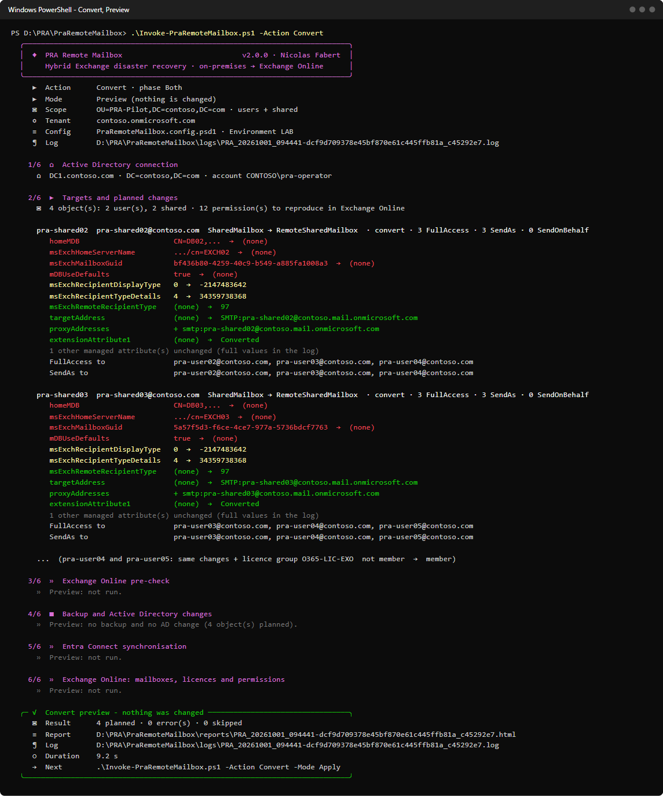
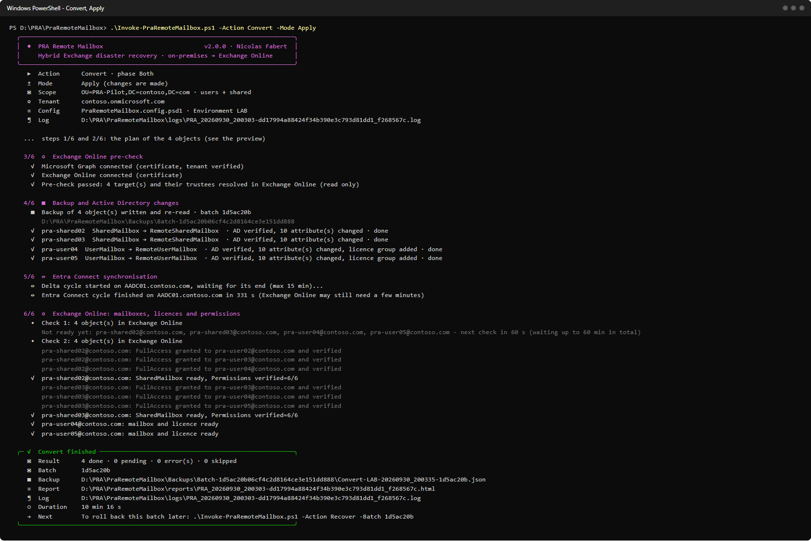
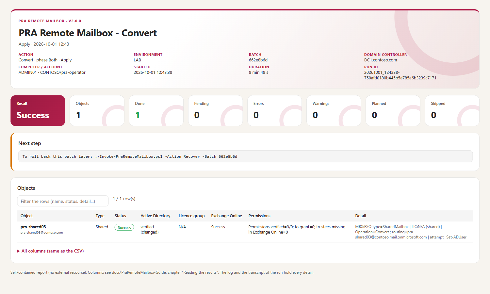
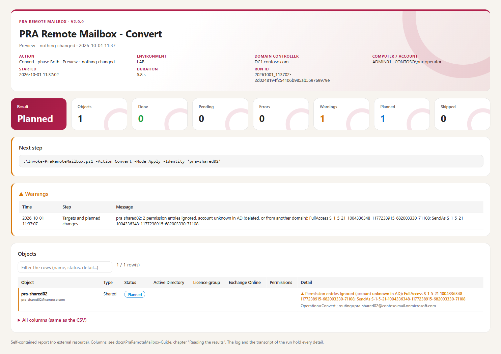

# PRA Remote Mailbox — Administrator guide

> When the on-premises Exchange servers are lost, **PRA Remote Mailbox** turns the on-premises mailboxes into **remote mailboxes**, so that every user gets a mailbox in **Exchange Online** within the hour — and rolls everything back when Exchange is available again. Only Active Directory is changed on-premises, and **every change is backed up first**.

> [!IMPORTANT]
> Files downloaded from the Internet may be blocked by Windows and fail to run. Before using this project, unblock every file in the downloaded folder:
>
> ```powershell
> Get-ChildItem "C:\Chemin\Du\Dossier" -Recurse -File -Force | Unblock-File
> ```
>
> Replace the example path with the folder where you downloaded or extracted this project.
>
> The `Install-Module` commands in this documentation use `-Force`, so they also update or reinstall a module that is already installed. If an older version still conflicts, close every PowerShell window, open a new one (as administrator for `-Scope AllUsers`), run `Uninstall-Module <ModuleName> -AllVersions -Force`, then run the `Install-Module` command again.

```cards
target | What it does | **Convert**: on-premises mailbox → remote mailbox (AD attributes, licence group, Entra Connect, shared mailbox permissions in Exchange Online).
refresh | How to go back | **Recover** a Convert batch: original AD attributes, licence removed, cloud shared mailboxes removed before the on-premises ones come back.
shield | How it protects | Preview first; a complete, re-read **backup** of every object before the first write; the first error stops everything.
terminal | How it is used | One script, one configuration file, one short **batch ID** that links the steps together.
```

## Quick start

```steps
Check the prerequisites | Windows PowerShell **5.1**, RSAT `ActiveDirectory`, `ExchangeOnlineManagement` 3.10+, `Microsoft.Graph.Authentication` and `Microsoft.Graph.Users` (chapter 4).
Edit the configuration | `config\PraRemoteMailbox.config.psd1`: scope, licence group, routing domain, Entra Connect server, tenant (chapter 6).
Preview | `.\Invoke-PraRemoteMailbox.ps1 -Action Convert` — targets and planned AD changes, **nothing is written**.
Apply | `.\Invoke-PraRemoteMailbox.ps1 -Action Convert -Mode Apply` — one confirmation, then backup, AD, sync, Exchange Online.
Keep the batch ID | The summary prints it (e.g. `efb9d60a`) with the next command: `-Action Recover -Batch efb9d60a` rolls the batch back.
```

> [!IMPORTANT]
> **Preview is the default.** Without `-Mode Apply` (or with `-WhatIf`) the tool only reads. With `-Mode Apply` it asks **one** confirmation after showing the plan; `-Force` skips it for unattended runs. No option ever skips a safety check.

> [!TIP]
> **Ready-to-use commands** — one user, a whole OU, only the shared mailboxes, a list, the roll-back: chapter 8, recipes 1 to 6.

# Part I · Understand

<!-- icon: book -->
## 1. Project background

**The disaster scenario**

- The mailboxes of the organisation are hosted **on-premises** (Exchange Server, hybrid with Exchange Online).
- The disaster recovery plan (PRA) covers the **loss of the on-premises Exchange servers**: mail must work again quickly, without waiting for their reconstruction.
- **Active Directory and Entra Connect are still available**: the identities, groups and synchronisation work.
- The decision is to give every user a **new, empty mailbox in Exchange Online** and to recreate the access to the shared mailboxes. The content of the lost mailboxes is **not** migrated by this tool (it comes back from the Exchange recovery, or from a backup product).
- When Exchange is back, the objects are **rolled back** to their on-premises state.

**Why a tool**

Turning an on-premises mailbox into a remote mailbox means rewriting about ten Exchange attributes in AD, per object, in a precise way, for hundreds of objects, under stress. A wrong value or a lost value cannot be recovered without a backup: this happened with the first script (version 1.2.5), whose backup was written **after** the changes.

| Constraint | Value |
|---|---|
| Objects | user mailboxes, shared mailboxes (rooms and equipment possible) |
| Systems changed | Active Directory (attributes, licence group), Entra Connect (one sync cycle), Exchange Online (shared mailbox permissions) |
| Systems NOT needed | Exchange on-premises (it is down) |
| Servers | one server (AD + cloud), or two servers: an AD server and an isolated "cloud" server |
| Traceability | backups, journals, logs, transcripts and reports kept for every run |

<!-- icon: flow -->
## 2. How it works

### Convert

The default flow, on one server (`Execution.Phase = 'Both'`):

```flow
directory | Read AD | scope, attributes, permissions
arrow | Backup | JSON + CLIXML + SHA-256, re-read
target | Write AD | remote mailbox, licence group
arrow | Sync | one Entra Connect cycle
cloud | Exchange Online | mailbox, licence, permissions
```

| Step | What happens |
|---|---|
| **Preview** | Every object of the scope is read, checked (it must be an on-premises mailbox) and planned. The console shows what will change. |
| **Exchange Online pre-check** | (Apply, phase Both) sign-in, every target and every permission holder resolved in Exchange Online — before any AD write. |
| **Backup** | One private folder `Backups\Batch-<id>`: the typed values to restore (JSON), every AD value (CLIXML), their SHA-256, then everything is **re-read and compared** with the plan. |
| **AD changes** | Per object: current state re-checked, `Set-ADUser`, AD re-read, licence group, AD re-read. The **first error stops the batch**. |
| **Entra Connect** | One Delta cycle, local or on `EntraConnect.Server`; the tool waits for its end. |
| **Exchange Online** | The tool waits (up to `Polling.TimeoutMinutes`) for the mailboxes and the licences, then grants FullAccess / SendAs / SendOnBehalf on the shared mailboxes and checks each grant. |

### What changes in AD

| Attribute | User mailbox | Shared mailbox |
|---|---|---|
| `msExchRecipientTypeDetails` | 1 → **2147483648** (RemoteUserMailbox) | 4 → **34359738368** (RemoteSharedMailbox) |
| `msExchRemoteRecipientType` | → **1** (3 with archive) | → **97** (99 with archive) |
| `msExchRecipientDisplayType` | → -2147483642 | → -2147483642 |
| `targetAddress` | → `SMTP:alias@tenant.mail.onmicrosoft.com` | same |
| `proxyAddresses` | + `smtp:alias@tenant.mail.onmicrosoft.com` | same |
| `homeMDB`, `homeMTA`, `msExchHomeServerName`, `mDBUseDefaults`, `msExchMailboxGuid` | cleared | cleared |
| retention tag (`extensionAttribute1` by default) | → `Converted` | → `Converted` |
| licence group | **added** | never (a shared mailbox has no licence) |

### Shared mailbox permissions — where they come from

Exchange on-premises is down: the tool cannot ask it (`Get-MailboxPermission` is not available). It reads the permissions where Exchange keeps a copy in **Active Directory**, on the account of the shared mailbox itself (default `SharedMailbox.PermissionSource = 'AD'`):

| Right granted in Exchange Online | Read in AD (attribute of the shared mailbox account) | Written there on-premises by |
|---|---|---|
| **FullAccess** | `msExchMailboxSecurityDescriptor` — *Allow* entries with the FullAccess right | `Add-MailboxPermission -AccessRights FullAccess` |
| **SendAs** | `nTSecurityDescriptor` (the AD permissions of the account) — *Allow* entries with the extended right **Send As** | `Add-ADPermission -ExtendedRights Send-As`, or the Exchange admin center |
| **SendOnBehalf** | `publicDelegates` | `Set-Mailbox -GrantSendOnBehalfTo` |

```flow
directory | Read AD | 3 attributes of the shared mailbox
arrow | Clean up | groups → users, exclusions
batch | Backup | lists of UPNs in the batch
arrow | Pre-check | every holder found in Exchange Online
cloud | Grant | once, then re-read
```

1. Only explicit *Allow* entries are kept: inherited and *Deny* entries are ignored.
2. System and administration accounts are never reproduced: SELF, `NT AUTHORITY\…`, `BUILTIN\…`, Domain / Enterprise / Schema Admins, Organization Management, Exchange Trusted Subsystem, Exchange Servers, Exchange Windows Permissions, Managed Availability Servers, Delegated Setup — plus the accounts listed in `SharedMailbox.ExcludeTrusteeSamAccountNames` (service accounts, for example).
3. A **group** is expanded to its users, nested groups included: Exchange Online receives one permission **per user** (UPN), never the group itself (lab T16). A user added to the group later does not get the access by itself.
4. An entry that points to an account **no longer in AD** ("Account Unknown": deleted account, or an account of another domain) cannot be granted: it is **ignored and reported as a warning** — a yellow `▲` line under the shared mailbox, a `[WARN]` line in the log, the `Warnings` column of the CSV, and the *Warnings* tile and card of the HTML report. The run goes on and its exit code does not change. Every other holder must exist in AD with a UPN.
5. The lists are saved in the backup of the batch (`SharedPermissions` of each record): the proof of what was granted.
6. Apply (phase `Both`): **before any AD write**, every holder is looked up in Exchange Online. An unknown holder stops the run before AD is changed. A user still on-premises is fine: Entra Connect has synchronised it as a mail user.
7. When the cloud shared mailbox exists: `Add-MailboxPermission` (FullAccess, with `AutoMapping`), `Add-RecipientPermission` (SendAs), `Set-Mailbox -GrantSendOnBehalfTo` (SendOnBehalf). A permission already present is only verified; a missing one is granted **once**, then re-read until Exchange Online shows it. In a hybrid organisation, Entra Connect usually brings `publicDelegates` along with the mailbox: SendOnBehalf is then already there and only verified (lab T16).

**How to check before the Apply**: the preview prints, under each shared mailbox, `FullAccess to`, `SendAs to` and `SendOnBehalf to` with the first holders; the log of the run has the complete lists (lines `PERMISSIONS | …`). After the Apply, every grant is printed and the report shows `Permissions verified=6/6`.

**Other sources**, when the AD entries are not reliable:

| `PermissionSource` | Holders |
|---|---|
| `'Csv'` | file `SharedMailbox.CsvPath`, columns `Shared,Group` (see `config\SharedPermissions.sample.csv`): the members of `Group` get FullAccess **and** SendAs on `Shared` |
| `'CustomAttribute'` | the AD group whose `SharedMailbox.CustomAttribute` (e.g. `extensionAttribute5`) contains the name of the shared mailbox: its members get FullAccess and SendAs |
| `'None'` | no FullAccess / SendAs |

SendOnBehalf always comes from `publicDelegates` (set `CaptureSendOnBehalf = $false` to skip it). A Recover does not remove the cloud permissions one by one: they disappear with the cloud mailbox; Convert never changes the on-premises permissions.

### Recover

The way back, from the Convert batch:

```flow
batch | Convert batch | original values
arrow | AD | users restored, shared → MailUser
cloud | Exchange Online | mailboxes gone?
arrow | Final restore | shared + tags
check | Done | on-premises again
```

- **Users** get their original attributes back and leave the licence group (unless they were already members before Convert).
- **Shared mailboxes** are first **deprovisioned** in Exchange Online (`msExchRemoteRecipientType` 8, MailUser): their on-premises attributes come back only when Exchange Online confirms that the cloud mailbox is gone. Otherwise two mailboxes would exist for the same object.
- The **retention tag** keeps the value `Converted` until the cloud check, then gets its original value back.
- On two servers, the cloud server writes a **Finalize package** that the AD server applies (`-Action Finalize`).

### The four actions

| Action | Purpose | Writes |
|---|---|---|
| `Convert` | on-premises mailbox → remote mailbox | AD, Entra Connect, Exchange Online permissions |
| `Recover` | roll back a Convert batch | AD, Entra Connect |
| `Finalize` | last step of a Recover on two servers | AD, Entra Connect |
| `Check` | is a mailbox provisioned / deprovisioned / retained? | nothing |

<!-- icon: lightbulb -->
## 3. Things to know

> [!WARNING]
> **The backups are the only way back.** A Recover restores what the Convert batch saved — nothing else. Keep the `Backups` folder on a durable, protected volume and copy it outside the server after each Apply. Never edit a backup: every file is checked by SHA-256 and a changed file is refused.

> [!CAUTION]
> **Convert creates new, empty mailboxes** in Exchange Online (`msExchMailboxGuid` is cleared). The content of the on-premises mailboxes is not moved. A Recover **deprovisions** the cloud mailboxes: mail received in the cloud during the disaster must be exported first if it has to be kept (or protected by a retention policy, see `Retention` in chapter 6).

> [!NOTE]
> **Nothing is automatic after an error.** The first error stops the batch: no next object, no sync, no cloud write, and no automatic rollback. The journal of the batch (`Journal-<id>.jsonl`) says exactly which write was started, applied and verified. Read the summary, fix the cause, run the same command again: objects already done are detected (`AlreadyDone`).

> [!TIP]
> **Two servers are supported.** If the cloud server has no access to AD (isolated network), run the AD part with `-Phase AD`, copy the batch folder, and run `-Phase Cloud` on the other server. The summary of each step prints the command of the next one.

# Part II · Set up

<!-- icon: checklist -->
## 4. Prerequisites

### Server or workstation

| Item | AD server (phase AD / Both) | Cloud server (phase Cloud / Both) |
|---|---|---|
| Windows PowerShell **5.1** (`powershell.exe`, not `pwsh`) | required | required |
| RSAT module `ActiveDirectory` | required | optional (without it, a Recover writes a Finalize package) |
| Entra Connect | the tool runs on the Entra Connect server, **or** WinRM to `EntraConnect.Server` | — |
| `ExchangeOnlineManagement` **3.10** or later | phase Both | required |
| `Microsoft.Graph.Authentication` and `Microsoft.Graph.Users` | phase Both | required |
| Durable disk for `Backups` | required | required (copies of the batches) |

```powershell
# Windows PowerShell 5.1, as administrator
Install-WindowsFeature RSAT-AD-PowerShell                       # Windows Server (client: RSAT optional feature)
Install-Module ExchangeOnlineManagement -MinimumVersion 3.10.0 -Scope AllUsers -Force
Install-Module Microsoft.Graph.Authentication, Microsoft.Graph.Users -Scope AllUsers -Force
```

> [!NOTE]
> Run the tool in a **new** Windows PowerShell window: it refuses an Exchange Online or Microsoft Graph session that already exists in the console (it must know which session it signs out).

### Permissions

| System | Right | Why |
|---|---|---|
| Active Directory | write the Exchange attributes, `proxyAddresses`, `targetAddress` and the retention tag of the objects in scope; read `nTSecurityDescriptor` | Convert / Recover |
| Active Directory | add / remove members of the licence group | licensing |
| Entra Connect server | member of `ADSyncOperators` (or local administrator) + WinRM access when remote | sync cycle |
| Exchange Online | **Exchange Recipient Administrator** (or a custom role with `Add-MailboxPermission`, `Add-RecipientPermission`, `Set-Mailbox`, `Get-EXO*`) | shared mailbox permissions, checks |
| Microsoft Graph | `User.Read.All` | licence and provisioning checks |

Certificate sign-in for unattended runs: annex C.

<!-- icon: download -->
## 5. Installation

1. Copy the package folder (`PraRemoteMailbox-2.0.0`, produced by `tools\New-PraPackage.ps1`) to the server, for example `D:\PRA\PraRemoteMailbox`.
2. Unblock the files if they were downloaded: `Get-ChildItem D:\PRA\PraRemoteMailbox -Recurse -File -Force | Unblock-File`.
3. Put `Backups` on a durable volume (default: `.\Backups` in the tool folder; see `Storage.BackupFolder`).
4. Fill in the configuration (chapter 6), then run a **Preview**: it checks the configuration, AD access and the scope without writing anything.

**Two servers**: install the same version on both, with a configuration of the **same `Environment`** (a batch is refused by a configuration of another `Environment`). The cloud server needs only the cloud sections; the AD server needs the AD sections.

| Folder | Content |
|---|---|
| `Invoke-PraRemoteMailbox.ps1` | the only script to run |
| `config\` | `PraRemoteMailbox.config.psd1` + CSV samples |
| `module\` | `PRA.Common` (console, log, configuration, reports), `PRA.Directory` (AD), `PRA.Backup` (capture), `PRA.Cloud` (Exchange Online, Graph) |
| `templates\` | HTML report template |
| `docs\` | this guide (Markdown + HTML) |
| `Backups\`, `logs\`, `reports\` | created by the runs |

<!-- icon: settings -->
## 6. Configuration

Everything is set in `config\PraRemoteMailbox.config.psd1` — the command line only chooses the action. The file is a PowerShell data file: text between quotes, `$true` / `$false`, numbers, `@( )` for lists. **An unknown setting is refused** (a typing mistake never goes unnoticed). Relative paths are relative to the tool folder.

### Identity of the environment

| Setting | Meaning |
|---|---|
| `Environment` | Label used in the backup file names; a batch is only accepted by a configuration of the same `Environment`. |
| `DomainController` | The writable DC used for **every** read and write of a run. Keep it fixed: AD versions (`uSNChanged`) are per DC, and the final restore of a Recover must use the DC of the AD phase. |

### Scope — which mailboxes are converted

| Setting | Meaning |
|---|---|
| `Scope.Mode` | `OU` (every on-premises mailbox under `SearchBase`), `Auto` (same, `SearchBase` optional = whole domain), `Group` (members of `GroupDN`, recursive), `Csv` (column `Identity` in `CsvPath`). |
| `Scope.IncludeShared`, `IncludeRoom`, `IncludeEquip` | Mailbox types included besides user mailboxes. |
| `Scope.ExcludeSamAccountNames` | Accounts never converted. System mailboxes are always excluded. |

`-Identity` converts one object instead of the scope; `-Scope UsersOnly|SharedOnly` and `-MaxObjects N` narrow a run (a pilot, a first wave).

### Conversion

| Setting | Meaning |
|---|---|
| `Remote.RecipientType` | `msExchRemoteRecipientType` of users: 1 (provision a mailbox); +2 automatically when the user has an archive and `HandleArchives = $true`. |
| `Remote.ClearMailboxGuid` | `$true`: clear `msExchMailboxGuid`, a new empty cloud mailbox is created. |
| `Routing.RoutingDomain` | `tenant.mail.onmicrosoft.com` — domain of the `targetAddress`. `AutoDetect` reuses an existing proxy address in this domain. |
| `Licensing.GroupDN` | AD group, synchronised to Entra ID, that carries the Exchange Online licence (group-based licensing). |

### Shared mailboxes

| Setting | Meaning |
|---|---|
| `SharedMailbox.RemoteRecipientType` | 97 (first provisioning of a shared mailbox), 99 with archive. |
| `SharedMailbox.PermissionSource` | Where FullAccess / SendAs holders are read, without Exchange: `AD` (default: the copy Exchange keeps on the account), `Csv` (`Shared,Group`), `CustomAttribute` (a group tagged with the name of the mailbox), `None`. Groups are expanded to their users. Details: chapter 2, *Shared mailbox permissions*. |
| `CaptureSendOnBehalf` | SendOnBehalf holders from `publicDelegates`. |
| `GrantFullAccess`, `GrantSendAs`, `GrantSendOnBehalf`, `AutoMapping` | What is granted in Exchange Online. |
| `ExcludeTrusteeSamAccountNames` | Accounts never reproduced (e.g. service or admin accounts found in the ACLs). |
| `KeepCloudSharedOnRecover` | `$true` = Recover keeps the cloud shared mailbox (rare). |
| `DeferOnPremRestore` | `$true` = on two servers, the cloud phase always writes a Finalize package. |

### Entra Connect

| Setting | Meaning |
|---|---|
| `EntraConnect.Sync` | `$true`: after the AD writes, run one cycle and wait for its end. Checked **before** the first AD write. `$false`: the operator synchronises. |
| `EntraConnect.Server` | Entra Connect server reached by PowerShell remoting; empty = this server (ADSync module). |
| `EntraConnect.PolicyType`, `TimeoutMinutes` | `Delta` (default) or `Initial`; how long to wait for the cycle. |

### Microsoft 365

| Setting | Meaning |
|---|---|
| `Cloud.TenantId`, `Cloud.Organization` | Tenant GUID and initial domain (`tenant.onmicrosoft.com`). Every session is checked against them. |
| `Cloud.AppId` + `Cloud.CertificateThumbprint` | Certificate sign-in (unattended, annex C). Both empty = interactive sign-in (`Cloud.UserPrincipalName` = expected account). |
| `Cloud.CheckMailbox`, `CheckLicense`, `MailboxCheckVia`, `RequiredSkuPartNumber` | What "ready" means for a user: mailbox (Exchange Online type, or Graph provisioning) and licence. |
| `Exo.DisableWAM` | Interactive sign-in in the browser instead of the Windows broker. |
| `Exo.GrantVerifyAttempts`, `GrantVerifyDelaySeconds` | After **one** grant, re-read up to N times (never granted twice). |
| `Exo.UseSubprocess` | Run every Exchange Online call in a child Windows PowerShell (certificate only; automatic with a module older than `MinModuleVersion`). |
| `Polling.IntervalMinutes`, `TimeoutMinutes` | How often and how long the cloud part waits (15 to 60 minutes is common after a sync). |

### Retention

`Retention.Tag` writes `Converted` in `extensionAttribute1` (by default) at Convert. In Exchange Online it becomes `CustomAttribute1`: an **adaptive scope** of a Purview retention policy can use it, so that the cloud mailbox is kept (inactive mailbox) when Recover deprovisions it. The policy itself is created outside the tool; `-Action Check -Expect Retained` checks the holds (`PolicyGuid`).

### Files

| Setting | Meaning |
|---|---|
| `Storage.BackupFolder` | Backups (one private folder per batch). Durable, protected, copied outside the server. |
| `Storage.ForbiddenBackupRoots` | Volumes where a backup is refused (temporary disks). |
| `Logging.Folder`, `Report.Folder`, `Report.Enabled` | One log + one transcript per run; CSV + HTML report per run. |
| `Execution.Phase` | Default of `-Phase`: `Both` on one server; `AD` or `Cloud` on the servers of a two-server setup. |

<!-- icon: key -->
## 7. Unattended execution

For a run without a person at the keyboard (scheduled task, orchestrator):

1. Certificate sign-in: create the application once (annex C) and set `Cloud.AppId` + `Cloud.CertificateThumbprint`. The certificate must be in the **CurrentUser\My** store of the account that runs the tool.
2. Run with `-Mode Apply -Force` under a domain account that has the AD rights of chapter 4.
3. Read the exit code: **0** done, **1** failed, **2** done but a next step is required (Pending objects). With `-PassThru`, the tool also returns the result object: `Status`, `ExitCode`, `BatchId`, `NextSteps`, the counters and the paths of the log and the reports (without `-PassThru`, nothing is written to the pipeline).

```powershell
$r = & 'D:\PRA\PraRemoteMailbox\Invoke-PraRemoteMailbox.ps1' -Action Convert -Mode Apply -Force -PassThru
if ($r.ExitCode -eq 1) { throw "PRA Convert failed: $($r.Issues[0].Message)" }
$r.BatchId      # keep it: Recover -Batch <id>
```

# Part III · Use

<!-- icon: play -->
## 8. Everyday use

Everything else comes from the configuration file; the command line only says **what** to do this time.

| Parameter | Values | Use |
|---|---|---|
| `-Action` | `Convert`, `Recover`, `Finalize`, `Check` | required |
| `-Mode` | `Preview` (default), `Apply` | `Apply` writes, after one confirmation |
| `-Phase` | `Both`, `AD`, `Cloud` | Convert / Recover on two servers; default `Execution.Phase` |
| `-Batch` | batch ID (8 characters) or path of the batch JSON | Recover, `-Phase Cloud`, Finalize; optional for Check |
| `-Identity` | UPN, sAMAccountName, DN or GUID | one object only |
| `-Scope` | `All` (default), `UsersOnly`, `SharedOnly` | filters the scope or the batch |
| `-MaxObjects` | number (0 = no limit) | Convert: first N objects |
| `-Expect` | `Provisioned` (default), `Deprovisioned`, `Retained` | Check only |
| `-ConfigPath` | path | another configuration file (another environment) |
| `-Force` | switch | Apply without the confirmation (unattended) |
| `-Once` | switch | cloud checks: one pass, no wait |
| `-PassThru` | switch | also returns the result object (chapter 7) |
| `-WhatIf` / `-Verbose` | switches | `-WhatIf` = Preview; `-Verbose` shows the debug lines of the log |

**The routine is always the same**: run the command **without** `-Mode Apply` (preview: nothing is written), read the plan, run the **same** command **with** `-Mode Apply`, answer `Y`, and **note the batch ID** printed at the end — it is the key of the roll-back. The recipes below are complete: copy them, change the names.

### Recipe 1 — Convert one user

Nothing to change in the configuration: `-Identity` replaces the scope (UPN, sAMAccountName, DN or GUID).

```powershell
cd D:\PRA\PraRemoteMailbox
.\Invoke-PraRemoteMailbox.ps1 -Action Convert -Identity jdupont@contoso.com               # 1. preview
.\Invoke-PraRemoteMailbox.ps1 -Action Convert -Identity jdupont@contoso.com -Mode Apply   # 2. convert
```

The preview shows `jdupont  UserMailbox → RemoteUserMailbox · convert`, the attributes that change and `licence group … not member → member`. The Apply backs up the account, writes AD, adds it to the licence group, runs one Entra Connect cycle, then waits until Exchange Online shows a mailbox and a licence. The summary ends with:

```text
Batch       1d5ac20b
Next        To roll back this batch later: .\Invoke-PraRemoteMailbox.ps1 -Action Recover -Batch 1d5ac20b
```

To undo: recipe 5.

### Recipe 2 — Convert a whole OU (users and shared mailboxes)

1. In `config\PraRemoteMailbox.config.psd1`, section `Scope`:

```powershell
Scope = @{
    Mode                   = 'OU'
    SearchBase             = 'OU=Paris,OU=Sites,DC=contoso,DC=com'   # sub-OUs included
    GroupDN                = ''
    CsvPath                = ''
    IncludeShared          = $true      # also the shared mailboxes of the OU
    IncludeRoom            = $false
    IncludeEquip           = $false
    ExcludeSamAccountNames = @('svc-scan', 'test01')    # never converted
}
```

2. Then:

```powershell
.\Invoke-PraRemoteMailbox.ps1 -Action Convert                 # preview: every on-premises mailbox of the OU
.\Invoke-PraRemoteMailbox.ps1 -Action Convert -Mode Apply     # convert them all, in one batch
```

Only **on-premises mailboxes** are taken: objects without an on-premises mailbox (already in Exchange Online, mail users, contacts) are ignored. For a first wave, add `-MaxObjects 10` (the first 10 by sAMAccountName). For the shared mailboxes, the preview also lists **who will get FullAccess, SendAs and SendOnBehalf** (see [shared mailbox permissions](#shared-mailbox-permissions-where-they-come-from)).

### Recipe 3 — Convert only the shared mailboxes

All the shared mailboxes of the configured scope (recipe 2), users excluded — for example a second wave after the users:

```powershell
.\Invoke-PraRemoteMailbox.ps1 -Action Convert -Scope SharedOnly               # preview
.\Invoke-PraRemoteMailbox.ps1 -Action Convert -Scope SharedOnly -Mode Apply   # convert
```

One shared mailbox only:

```powershell
.\Invoke-PraRemoteMailbox.ps1 -Action Convert -Identity compta@contoso.com
.\Invoke-PraRemoteMailbox.ps1 -Action Convert -Identity compta@contoso.com -Mode Apply
```

Shared mailboxes never get a licence. After the sync, the tool waits for the cloud shared mailbox, then grants each permission found in AD and re-reads it; every grant is printed (`compta@contoso.com: FullAccess granted to marie@contoso.com and verified`). The permission holders do **not** need to be converted first: a user still on-premises exists in Exchange Online as a synchronised mail user and can receive the permission (it is useful as soon as that user has a cloud mailbox). `-Scope SharedOnly` takes the shared mailboxes even when `IncludeShared = $false`; with `Scope.Mode = 'Csv'`, use a file that lists only shared mailboxes. The mirror option is `-Scope UsersOnly`.

### Recipe 4 — Convert a list of mailboxes or the members of a group

| Source | Configuration (`Scope`) |
|---|---|
| A CSV file | `Mode = 'Csv'`, `CsvPath = '.\config\Wave1.csv'` — one column `Identity` (UPN, sAMAccountName, DN or GUID), see `config\Targets.sample.csv`. Every line must be an on-premises mailbox, otherwise nothing is converted. |
| An AD group | `Mode = 'Group'`, `GroupDN = 'CN=PRA-Wave1,OU=Groups,DC=contoso,DC=com'` (nested groups included). |

The commands are those of recipe 2.

### Recipe 5 — Roll back (Recover)

Use the batch ID of the Convert (summary, report, or the folder name `Backups\Batch-<id>…`):

```powershell
.\Invoke-PraRemoteMailbox.ps1 -Action Recover -Batch 1d5ac20b                                       # preview of the roll-back
.\Invoke-PraRemoteMailbox.ps1 -Action Recover -Batch 1d5ac20b -Mode Apply                           # the whole batch
.\Invoke-PraRemoteMailbox.ps1 -Action Recover -Batch 1d5ac20b -Identity jdupont@contoso.com -Mode Apply   # one object of the batch
```

Users get their original attributes back and leave the licence group. Shared mailboxes are first removed from Exchange Online; their on-premises attributes come back when Exchange Online confirms it (up to `Polling.TimeoutMinutes`), in the same run. Their on-premises permissions were never changed.

### Recipe 6 — Check, at any time

```powershell
.\Invoke-PraRemoteMailbox.ps1 -Action Check -Batch 1d5ac20b                          # are the mailboxes of the batch in Exchange Online?
.\Invoke-PraRemoteMailbox.ps1 -Action Check -Identity jdupont@contoso.com             # one mailbox
.\Invoke-PraRemoteMailbox.ps1 -Action Check -Batch 1d5ac20b -Expect Deprovisioned     # after a Recover
```

Read only. Check waits for the expected state (up to `Polling.TimeoutMinutes`); add `-Once` for a single pass.

### Scenario C — Convert on two servers

```steps
AD server | `.\Invoke-PraRemoteMailbox.ps1 -Action Convert -Phase AD -Mode Apply` — backup, AD changes, sync. The summary prints the batch ID.
Copy | Copy the folder `Backups\Batch-<id>...` to the `Backups` folder of the cloud server (the whole folder, unchanged).
Cloud server | `.\Invoke-PraRemoteMailbox.ps1 -Action Convert -Phase Cloud -Batch <id> -Mode Apply` — waits for the mailboxes, grants the permissions.
```

### Scenario D — Recover on two servers

```steps
AD server | `-Action Recover -Phase AD -Batch <convert id> -Mode Apply` — users restored, shared mailboxes deprovisioned. Exit code 2: next step required.
Copy | Copy the new `Batch-<recover id>` folder **and** the original `Batch-<convert id>` folder to the cloud server.
Cloud server | `-Action Recover -Phase Cloud -Batch <recover id> -Mode Apply` — checks the deprovisioning and writes a Finalize package `Finalize-<id>`.
Copy back | Copy the `Finalize-<id>` folder to the `Backups` folder of the AD server.
AD server | `-Action Finalize -Batch <finalize id> -Mode Apply` — restores the shared mailboxes and the retention tags.
```

### What you see



1. The **banner**: action, mode, scope, tenant, configuration and log file.
2. **Numbered steps**. In a preview, the steps that write are shown as skipped.
3. For each object: its type change (`UserMailbox → RemoteUserMailbox`) and **only the attributes that change** — green = added, yellow = changed, red = removed. For a shared mailbox, the holders that will get **FullAccess**, **SendAs** and **SendOnBehalf** in Exchange Online. The full before/after values and the complete lists of holders are in the log.
4. The **summary**: result, batch ID, backup, report, log, duration and the **next command**.



### Exit codes

| Code | Meaning | What to do |
|---|---|---|
| 0 | Done (or preview without error) | nothing |
| 1 | Failed — see `Error` in the summary | fix the cause, run the same command again |
| 2 | Done, but objects are **Pending** | run the next step printed in the summary |

<!-- icon: chart -->
## 9. Reading the results

### The HTML report



One page per run in `reports\`: tiles with the counters (including **Warnings**), the next step, the warnings of the run, one row per object (filter box; a row with a warning has a yellow mark and the warning above its detail), and the run errors. It is self-contained (no external resource).

### Warnings

A warning never stops the run and never changes the exit code; it says that something was **left aside on purpose** and should be read. Today: the permission entries of a shared mailbox that point to an account no longer in AD (chapter 2). It is shown in four places: a yellow `▲` line in the console under the object, `[WARN]` in the log, the `Warnings` column of the CSV, and in the HTML report (*Warnings* tile, *Warnings* card, yellow mark on the row). The summary card of the console turns yellow and shows the last warnings.



### Statuses

| FinalStatus | Meaning |
|---|---|
| `Planned` | Preview: this is what Apply would do. |
| `Success` | Done and verified (AD re-read; cloud state reached). |
| `AlreadyDone` | Nothing to change: the object was already in the expected state (counted as done). |
| `Pending` | AD done, waiting for another step (shared mailbox deprovisioning, Finalize). |
| `Error` | Stopped; see `Detail` and the log. |
| `Skipped` | Not processed (the batch stopped before it, or no applicable check). |

### The CSV columns

`ObjectGuid`, `SamAccountName`, `UserPrincipalName`, `Action`, `IsShared`, `ADApplied` (an AD write was made), `ADVerified` (AD re-read matches), `GroupAction` (Added / Removed / Preserved), `BackupPath`, `LastOperation`, `CloudMailbox`, `CloudLicense`, `CloudStatus`, `CloudDetail`, `PreserveCloudMailbox`, `PreserveLicense`, `DeprovisionConfirmed`, `PermDetail` (permissions verified / to grant / trustees missing), `PermMissing`, `FinalStatus`, `Detail`, `Warnings` (e.g. permission entries ignored). Separator `;`, UTF-8.

> [!CAUTION]
> Logs, transcripts and reports contain AD values (addresses, DNs). Protect them like the backups; never publish them unfiltered.

<!-- icon: database -->
## 10. Files: batches, proofs and packages

```text
Backups\
  Batch-efb9d60a75054b6b9cabefa418121934\          one batch = one Apply (private ACL)
    Recover-LAB-20260930_194723-efb9d60a.json       typed records: what is restored (schema 3)
    Recover-LAB-20260930_194723-efb9d60a.json.sha256
    Recover-LAB-20260930_194723-efb9d60a.clixml     every AD value of every object (data-only CLIXML)
    State-efb9d60a75054b6b9cabefa418121934.json     AD proof: objects verified after the writes (+ .sha256)
    Journal-efb9d60a75054b6b9cabefa418121934.jsonl  Started / Applied / Verified / Failed per write
  Finalize-3f2c90e1....\                           Finalize package (Recover on two servers)
  <RunId>-cloud\CloudOperations.jsonl              journal of the Exchange Online grants of a run
logs\     PRA_<RunId>_<n>.log  and  .transcript.txt
reports\  PRA_<RunId>_<n>.csv  and  .html
```

- **Batch ID** = the first 8 characters of the folder name; `-Batch` accepts 8 characters or more, or the path of the JSON file.
- The **State** file is the proof that the AD part was done and verified: the cloud phase and Finalize refuse to write without it.
- Copy **whole folders**, never single files, and never rename them.
- Keep the batches at least until the Recover is finished and checked; then archive them with the logs.

# Part IV · Maintain

<!-- icon: layers -->
## 11. Inside the tool

### Execution flow

```flow
terminal | Invoke-PraRemoteMailbox | action, mode, phase
arrow | PRA.Common | config, audit, console
directory | PRA.Directory | plans, backup, AD writes
arrow | PRA.Backup | CLIXML capture
cloud | PRA.Cloud | EXO, Graph, grants
```

The run state is one hashtable, the **context** (`$context`), created by the entry script and passed to every function: configuration, mode, the result rows, the run errors (`Issues`), the files produced, the current step, and two callbacks: `Approval` (ShouldProcess before every write) and, in the cloud phase, `AssertCloudAuthorization` (re-reads the AD proof before every Exchange Online grant).

### The safety contract

1. **Read everything, then write.** Every object of the batch is read and planned before the first write.
2. **Backup before the first write**, for the whole batch: typed JSON (what Recover restores), data-only CLIXML (every AD value), SHA-256, private folder, new files only, then **re-read and compared** with the plans. A failure at the 13th object stops before any write.
3. **Before each write**: no previous error, Apply mode, approval, backup unchanged, and the object **re-read**: same `uSNChanged`, same DN, same values as in the backup. After each write: re-read of the expected values.
4. **First error = stop**: no next object, no sync, no cloud write, no automatic rollback. The journal records `Started` before and `Applied` after every write.
5. **Proofs**: the State file lists the objects verified; the cloud phase, Finalize and the sync refuse a batch without a valid proof, and Finalize refuses an object changed since the proof.
6. **A cloud error is never "absent"**: deprovisioning is confirmed only when Exchange Online returns no mailbox **and** a MailUser recipient. Only then are the shared mailboxes restored on-premises.
7. **Preview and Check never write** (AD, Entra Connect, Exchange Online); they still write their log, transcript and report.

### Code map

| File | Content |
|---|---|
| `Invoke-PraRemoteMailbox.ps1` | Parameters, context, the four actions step by step, batch resolution (`Get-PraBatchFile`), one confirmation (`Confirm-PraApply`), Finalize package (`Save-PraFinalizePackage`, `Get-PraFinalizeInput`), next-step hints. |
| `module\PRA.Common.psm1` | 1 console theme · 2 console and log (`Write-PraBanner/Step/Item/Log/Summary`) · 3 configuration (`Import-PraConfiguration`, defaults = list of valid keys) · 4 audit (log + transcript) · 5 results (`Get-PraOutcome`, CSV/HTML, `Complete-PraRun`). |
| `module\PRA.Directory.psm1` | 1 receipts and files · 2 directory reads (`Get-PraTarget`, `Get-PraUser`) · 3 attribute states and before/after display · 4 shared permissions from AD · 5 plans (`New-PraPlan`) · 6 backups and proofs · 7 writes (`Invoke-PraAdBatch`) · 8 Entra Connect (`Invoke-PraSync`). |
| `module\PRA.Backup.psm1` | Data-only CLIXML codec (write, stream-validate). |
| `module\PRA.Cloud.psm1` | Exchange Online worker (fixed commands, identity checks), sessions, pre-check, cloud phase (polling, grants), retention check. |

<!-- icon: wrench -->
## 12. Modifying the tool

The rule: **change the plan, never the guards.** The backup, the re-reads and the proofs work for any attribute listed in the plan.

### Manage one more AD attribute

1. Add it to `$script:AttributeKinds` in `PRA.Directory.psm1` with its type (`String`, `MultiString`, `Bytes`, `Bool`, `Int`, `Long`).
2. Set its target value in `New-PraPlan` (branch `Convert`, and `Deprovision` if needed). Recover restores it automatically from the backup.
3. Old batches do not contain it: `Assert-PraStoredRecord` refuses them for Recover. Decide explicitly (new backup schema, or keep old batches on the previous version).
4. Add a gate test (chapter 13) with a synthetic user having and not having the attribute.

### Change the routing address or the recipient types

`Get-PraRoutingAddress` (routing) and the `Convert` branch of `New-PraPlan` (types). Keep `msExchRemoteRecipientType` of shared mailboxes at 97/99: 100/102 mean "already migrated" and are refused.

### Add a cloud check

In `Invoke-PraCloudPhase` (`PRA.Cloud.psm1`): add the fact in `Get-PraGraphFact` or in the worker (`Mailbox`, `Recipient`), then include it in `$mbok` / `$licok`. A new Exchange Online **write** must go through `Invoke-PraPermissionGrant` (approval, proof, journal, one call, bounded re-read).

### Change the console or the report

Texts and icons: `PRA.Common.psm1`, region 1-2. The HTML report: `templates\Report.template.html` (markers `{{...}}`, no code change). The CSV columns: `$script:RowFields`.

### PowerShell pitfalls met during the build

| Pitfall | Rule |
|---|---|
| Windows PowerShell 5.1 transcript writes every `Write-Host -NoNewline` piece on its own line | one `Write-Host` per line, one colour per line (`Write-PraHost`) |
| `GetNewClosure()` copies the variables of the current scope, including parameters with validation attributes (an empty `[ValidateSet]` parameter throws) | create closures inside a small function (`New-PraApprovalCallback`) |
| `ShouldProcess` reads `$ConfirmPreference` of the calling scope | the approval closure sets it from `$context.ConfirmPreference` |
| App-only Exchange Online sessions report the organisation domain as `TenantID` | the session guard accepts `Cloud.Organization` + `AppId` |
| `Import-Module ActiveDirectory` creates an `AD:` drive on a default DC | `$env:ADPS_LoadDefaultDrive = 0` before the import |
| Files without BOM are read as ANSI by Windows PowerShell 5.1 | every `.ps1/.psm1/.psd1` is UTF-8 **with BOM** (checked by the gate) |
| `Get-ADUser -Identity` does not search the UPN | exact, escaped LDAP filter (`Get-PraUser`) |
| With `-ErrorAction Stop`, Windows PowerShell 5.1 writes a `TerminatingError` line in the transcript even when the error is caught and expected (e.g. "No permissions were found" before a FullAccess grant) | read an expected error through `-ErrorAction SilentlyContinue -ErrorVariable` and check every record; anything else is thrown |
| `Get-EXORecipient -UserPrincipalName` answers an absent object with HTTP 404 (`ManagementObjectNotFoundException`), not with an empty result | only that exact answer, for that exact UPN, means "absent" (`MissingRecipient`); any other error stops |
| Exchange Online assemblies stay loaded in the console after a run; Microsoft Graph loaded later fails (`GetTokenAsync ... does not have an implementation`) | Graph is connected before EXO within a run; between runs, a clear message asks for a new window |

<!-- icon: beaker -->
## 13. Testing a change

### The gate (no directory, no tenant)

```powershell
powershell.exe -NoProfile -File .\tests\Invoke-TestGate.ps1
```

It checks every file (parse, UTF-8 BOM, help), runs PSScriptAnalyzer (Windows PowerShell 5.1 compatibility profiles), then the Pester suite `tests\PraRemoteMailbox.Tests.ps1`: synthetic AD and ADSync modules, a synthetic cloud barrier, the **real** entry script in a separate Windows PowerShell process. It proves in particular: no write before the complete backup, stop at the first error, no write in Preview/-WhatIf, no Apply without confirmation in a non-interactive process, memory bounds with 13 shared mailboxes × 500 trustees, proofs and Finalize packages. Evidence: `tests\evidence\gate\<date>\` (`RESULT.txt`, `gate-result.json`, Pester XML).

Requirements: Pester 5 or later and PSScriptAnalyzer 1.25.0 (machine-wide modules). Every test is mandatory: a skipped or missing test fails the gate.

Release 2.0.0 (2026-10-01, Windows PowerShell 5.1): **279 tests, 279 passed**, 0 analyzer error, about 12 minutes — evidence `tests\evidence\gate\v2.0.0-release`. The only analyzer warnings on the delivered files are expected: `Write-Host` in the console module (14, by design) and `ConvertFrom-Markdown` in the documentation builder (6, PowerShell 7 tool). Compared with the 325 tests of 1.3.6, the 61 combinations of the removed path options (`-BackupFile`, `-StateFile`, `-LogPath`, `-TranscriptPath`, `-ReportDirectory`) are replaced by 9 tests of `-Batch` and of the confirmation.

### The lab campaign

After a change of the engine, repeat the campaign of annex B on the lab: Preview, Convert Apply (users + shared), Check, Recover on two servers (AD, Cloud with Finalize package, Finalize), plus a Recover of a batch written by the previous version.

# Annexes

<!-- icon: lifebuoy -->
## Annex A — Troubleshooting

| Message | Cause | What to do |
|---|---|---|
| `Configuration: unknown setting X` | typing mistake or setting of another version | compare with chapter 6 |
| `Batch <id> not found under ...` | the batch folder is not in `Storage.BackupFolder` | copy the whole `Batch-...` / `Finalize-...` folder there, or give the path of the JSON file |
| `The Convert batch used by this Recover is not in ...` | cloud phase of a Recover without the original Convert batch | copy the `Batch-<convert id>` folder too |
| `Batch ... is a Convert batch: the cloud phase of a Recover needs the batch printed by its AD phase` | wrong ID | use the ID printed by `Recover -Phase AD` |
| `EntraConnect.Sync = $true but the ADSync module is not on this server` | AD part not on the Entra Connect server | set `EntraConnect.Server`, or run on the Entra Connect server, or `Sync = $false` |
| `Entra Connect server X is not reachable with PowerShell remoting` | WinRM / rights | `Test-WSMan X`; the account must be admin or `ADSyncOperators` on X |
| `An Exchange Online session already exists in this console` | the console was used for EXO before | open a new Windows PowerShell window |
| `Microsoft Graph cannot load in this console (assembly conflict ...)` | Exchange Online was used earlier in the same window (for example Recover, then Check): its assemblies stay loaded and Microsoft Graph cannot load next to them | open a new Windows PowerShell window for each run that needs Microsoft Graph (Check, Convert of users) |
| `Exchange Online session: wrong tenant (...)` | signed in to another tenant, or `Cloud.Organization` wrong | fix `Cloud.TenantId` / `Cloud.Organization` |
| `uSNChanged changed: the object was modified since it was planned` | someone (or a sync) changed the object between plan and write | run the command again (a new plan is made) |
| `Finalize: use the domain controller of the proof` | `DomainController` differs from the DC of the Recover AD phase | set the same `DomainController` |
| `Expected state not reached (timeout or -Once)` | Exchange Online is slow (provisioning up to 60 min after a sync) | run the cloud phase again later (`-Phase Cloud -Batch <id>`); nothing is granted twice |
| `Permission ... trustees missing in Exchange Online` | a permission holder is not known in Exchange Online (not synchronised) | check that Entra Connect synchronises the holder, or exclude it (`ExcludeTrusteeSamAccountNames`) |
| `Trustee not found in Exchange Online at the pre-check: <upn>` | same, found before any AD write (phase Both) | same; nothing was written |
| `▲ <mailbox>: N permission entries ignored, account unknown in AD (deleted, or from another domain): FullAccess S-1-5-21-...` (warning) | a permission entry of the shared mailbox points to an account that no longer exists ("Account Unknown") | nothing to do: the other holders are granted. To clean the source: SendAs entries in *Active Directory Users and Computers* → account of the shared mailbox → *Security*; FullAccess entries are removed when Exchange is back (`Remove-MailboxPermission`). If the account belongs to **another domain** and must keep its access, grant it by hand in Exchange Online |
| `Trustee without UPN` / `Unsupported trustee type` | a holder is an account without UPN, or a contact / computer | give it a UPN, or exclude it (`ExcludeTrusteeSamAccountNames`) |
| `Apply needs a confirmation and this console cannot ask for one` | `-Mode Apply` in a non-interactive run | add `-Force` |

> [!TIP]
> Start with the **summary card**, then the **log** (`[ERROR]` lines, full before/after values with `[DETAIL]`), then the **journal** of the batch to see which write was started and applied.

<!-- icon: check -->
## Annex B — Lab test campaign 2026-09-30

Lab: one Active Directory domain with two domain controllers, Entra Connect on its own server, Exchange servers stopped (= disaster), a Microsoft 365 test tenant; a dedicated operator account, certificate sign-in. Objects of a test OU: `pra-user04`, `pra-user05` (user mailboxes), `pra-shared02`, `pra-shared03` (shared mailboxes, 3 FullAccess + 3 SendAs each).

All runs were made with the **real** script on a lab administration server (Windows PowerShell 5.1), against the real directory, the real Entra Connect server and the real tenant. Result: **28 runs**: 26 PASS, and 2 runs (T17, T18) that found defects 3 and 4, fixed since and covered by the gate (list below).

| # | Command (short form) | What was checked | Result |
|---|---|---|---|
| T1 | `-Action Convert` (Preview) | plan of the 4 objects of the scope, nothing written, report with "Planned" rows | PASS |
| T2a | `-Action Recover -Batch <1.3.6 batch> -Mode Apply -Force` | backward compatibility: Recover of a Convert batch written by **1.3.6** (`pra-user01`, `pra-shared01`), AD restore + sync + cloud | PASS after fixes 1 and 2 |
| T2b | `-Action Recover -Phase Cloud -Batch <id>` without the Convert batch | clear message naming the missing `Batch-<convert id>` folder, nothing written | PASS |
| T2c | `-Action Recover -Phase Cloud -Batch <id> -Mode Apply -Force` | cloud phase of the 1.3.6 Recover, on-premises restore made inline | PASS |
| T3 | `-Action Convert -Mode Apply -Force` (phase Both) | 2 users + 2 shared, 12 permissions: backup, AD writes and proofs, remote delta sync, licence group, provisioning wait, permissions re-granted and verified. Batch `1d5ac20b`, **10 min 16 s** | PASS |
| T4 | `-Action Check -Expect Provisioned` | the 4 mailboxes are cloud mailboxes, permissions present | PASS |
| T5a | `-Action Recover -Phase AD -Batch 1d5ac20b -Mode Apply -Force` | AD restore, proof, sync; **exit code 2** (cloud phase due). Batch `f4e7a0bd` | PASS |
| T5b | `-Phase Cloud -Batch 1d5ac20b` (negative), then `-Phase Cloud -Batch f4e7a0bd` with a "cloud server" configuration (`DeferOnPremRestore`) | the Convert ID is refused with the right ID to use; cloud phase OK and **Finalize package** `593c9c5f` written | PASS |
| T5c | `-Action Finalize -Batch 593c9c5f` (Preview, then Apply) | package and proof hashes verified, on-premises restore of the shared mailboxes | PASS |
| T6 | `-Action Finalize -Batch 593c9c5f -Mode Apply -Force` (replay) | idempotent: nothing to write, success | PASS |
| T7 | `-Action Convert -Phase AD -Identity pra-shared02 -Mode Apply -Force` | one object, AD part only. Batch `79f5a1e1`, exit code 2 | PASS |
| T8 | `-Action Convert -Phase Cloud -Batch 79f5a1e1` (Preview) | one pass, 3 permissions reported "to grant", no wait, nothing granted | PASS |
| T9 | `-Action Convert -Phase Cloud -Batch 79f5a1e1 -Mode Apply -Force` | provisioning wait, permissions granted and verified | PASS |
| T10 | `-Action Recover -Batch 79f5a1e1 -Mode Apply -Force` (phase Both, one server) | AD restore, sync, cloud phase and on-premises restore inline, **12 min 29 s** | PASS |
| T11 | `-Mode Apply` without `-Force` in a non-interactive process | stops **before the backup** with "Apply needs a confirmation", exit code 1, nothing written | PASS |
| T12 | `-Action Check -Expect Deprovisioned` | the objects are back on-premises | PASS |
| T13 | `-Action Convert` (Preview) | final plan of the 4 objects (run again on 2026-10-01 for the screenshot of chapter 8) | PASS |
| T14 | `-Action Convert -Scope SharedOnly` (Preview, 2026-10-01) | only the 2 shared mailboxes; FullAccess / SendAs holders listed under each one, complete lists in the log | PASS |
| T15 | `-Action Convert -Identity pra-shared02` (Preview, 2026-10-01) after giving FullAccess + SendAs to a temporary account, then deleting it | the 2 entries of the deleted account are ignored: yellow line and yellow summary card, `[WARN]` in the log, CSV column `Warnings`, *Warnings* tile and card in the report; exit code 0; the permissions of `pra-shared02` were restored after the test | PASS |
| T16 | `-Action Convert -Identity pra-shared03` (Preview, then `-Mode Apply -Force`, 2026-10-01) after adding on `pra-shared03`: FullAccess for the group `PRA-Shared03-Team` (`pra-user01` + a nested group with `pra-user02`), SendOnBehalf for `pra-user01`, and removing its SendAs in Exchange Online | 9 permissions: the group becomes its 2 users (nested group included) and never gets a right itself; FullAccess **granted** and verified for 5 users, SendAs **granted** and verified for 3; SendOnBehalf already brought by Entra Connect, verified; an independent read of Exchange Online shows the same; **0 `TerminatingError` line** in the transcript. Batch `662e8b6d`, **8 min 48 s** | PASS |
| T17 | `-Action Recover -Batch 662e8b6d -Mode Apply -Force` | AD part and sync OK; at the first cloud check Exchange Online answered 404 "couldn't be found" for the mailbox that was turning into a MailUser: stop, nothing restored on-premises (defect 3) | defect found → fix 3 |
| T17b | `-Action Recover -Phase Cloud -Batch 8995dcbf -Mode Apply -Force`, after removing the T16 test material from the object | refused before any write: "the AD proof is out of date" (the object changed after the AD phase) | PASS (protection) |
| T17c | `-Action Recover -Batch 662e8b6d -Mode Apply -Force` (again) | AD already in the expected state (0 change, no sync), deprovisioning confirmed, on-premises restore (10 attributes) and sync. **4 min 24 s**, 0 `TerminatingError` line | PASS |
| T18 | `-Action Check -Expect Deprovisioned -Identity pra-shared03`, in the same process as T17 | Microsoft Graph cannot load after the Exchange Online assemblies of T17 (`GetTokenAsync ... does not have an implementation`) (defect 4) | defect found → fix 4 |
| T18b | same command in a new process | `pra-shared03` deprovisioned in Exchange Online (MailUser), back on-premises in AD | PASS |

Measured durations: delta sync on the Entra Connect server (remote) about **5 min 30 s**; cloud phase alone 28 s to 61 s once the objects are provisioned.

Defects found by the campaign and fixed in 2.0.0 (all now covered by the gate):

1. With `-Force`, the approval callback of the AD engine still called `ShouldProcess` with `ConfirmImpact High` → "Windows PowerShell is in NonInteractive mode" in the scheduled task, **before any write** (fail-closed). Fix: the single confirmation of the run sets `ConfirmPreference = None` for the callbacks.
2. The session guard compared the organisation domain of a certificate session with `Cloud.TenantId` and refused it (finding 1 of annex F). Fix: the guard accepts `Cloud.Organization` and checks the `AppId`.
3. (T17) `Get-EXORecipient -UserPrincipalName` answers an absent object with HTTP 404 `ManagementObjectNotFoundException`. During the Recover cloud check, while the mailbox turns into a MailUser, this answer stopped the run (fail-closed). Fix: this exact answer, for this exact UPN, means "not there yet": the check waits and reads again; any other error still stops.
4. (T18) A run that needs Microsoft Graph after a run that used Exchange Online in the same console failed with an obscure `GetTokenAsync` error. Fix: a clear message asks for a new Windows PowerShell window (annex A).
5. (transcripts of T3 and T9) Before each FullAccess grant, the normal "No permissions were found" answer appeared as a `TerminatingError` line in the transcript. Fix: read through `-ErrorVariable`; T16 and T17c: 0 such line.

The lab was left as before the tests: T16 test material removed (groups deleted, `msExchMailboxSecurityDescriptor` identical to its copy taken before the test, `publicDelegates` empty), `pra-shared03` back on-premises.

Lab fix made before the campaign (outside the tool): the second domain controller had stopped replicating from the first one (Kerberos `0x80090322`, stale KDC ticket); fixed by purging the tickets of the computer account and forcing the replication. The operator account and the lab application (annex C) were created for the campaign.

<!-- icon: key -->
## Annex C — Certificate sign-in (application)

Least privilege for unattended runs: one application, one certificate, two application permissions and one Exchange role.

```powershell
# 1. Certificate, in the store of the account that runs the tool (private key not exportable)
$cert = New-SelfSignedCertificate -Subject 'CN=PRA Remote Mailbox' -CertStoreLocation Cert:\CurrentUser\My `
    -KeyExportPolicy NonExportable -KeySpec Signature -KeyLength 2048 -HashAlgorithm SHA256 -NotAfter (Get-Date).AddYears(1)
Export-Certificate -Cert $cert -FilePath .\pra-app.cer
$cert.Thumbprint                                   # -> Cloud.CertificateThumbprint
```

```powershell
# 2. Application (Azure CLI, Global Administrator or Privileged Role Administrator)
$app = az ad app create --display-name 'PRA Remote Mailbox' --sign-in-audience AzureADMyOrg --query appId -o tsv
az ad app credential reset --id $app --cert '@pra-app.cer' --append
$sp = az ad sp create --id $app --query id -o tsv
# Microsoft Graph: User.Read.All (application)
az ad app permission add --id $app --api 00000003-0000-0000-c000-000000000000 --api-permissions df021288-bdef-4463-88db-98f22de89214=Role
# Office 365 Exchange Online: Exchange.ManageAsApp (application)
az ad app permission add --id $app --api 00000002-0000-0ff1-ce00-000000000000 --api-permissions dc50a0fb-09a3-484d-be87-e023b12c6440=Role
az ad app permission admin-consent --id $app
# 3. Entra role Exchange Recipient Administrator for the service principal
az rest --method POST --url https://graph.microsoft.com/v1.0/roleManagement/directory/roleAssignments `
    --body "{ \"roleDefinitionId\": \"31392ffb-586c-42d1-9346-e59415a2cc4e\", \"principalId\": \"$sp\", \"directoryScopeId\": \"/\" }"
$app                                               # -> Cloud.AppId
```

> [!NOTE]
> With certificate sign-in, Exchange Online identifies the session by the **organisation domain** and the **AppId**: `Cloud.Organization` must be the initial domain (`tenant.onmicrosoft.com`) and `Cloud.AppId` the application ID. To revoke: delete the certificate credential of the application (or the application).

<!-- icon: file -->
## Annex D — File formats

| File | Format | Key fields |
|---|---|---|
| Backup `<Op>-<Env>-<date>-<id>.json` | schema **3** (schema 1 and 2 of 1.2.x/1.3.0-1.3.2 still read) | `Operation` (Convert, Recover, Finalize), `BatchId`, `Environment`, `Server`, `RawFile` + `RawHash`, `SourceBackupHash` (Recover/Finalize: SHA-256 of the Convert backup), `Records[]` (`Attributes` = before, `PlannedAttributes` = after, `Licensing`, `Retention`, `SharedPermissions`, `CapturedUsnChanged`) |
| Capture `.clixml` | `PraDataOnlyClixml-v1` | every attribute returned by AD, closed descriptors (no native object) |
| AD proof `State-<id>.json` | schema 2 | `Kind = ADVerified`, `BackupFile` + `BackupHash`, `Records[]` (`ObjectGuid`, `Operation`, `VerifiedUsnChanged`) |
| Journal `Journal-<id>.jsonl` | one JSON per line | `Target`, `Operation`, `Status` (Started, Applied, Verified, FailedOrIndeterminate) |
| Finalize package manifest | schema 2, `Operation = RecoverFinalize` | `SourceBackupHash`, `StateHash`, `Items[]` (`RestoreShared`, `RestoreTag`, `DeprovisionConfirmed`) |

Every JSON has a `.sha256` file; a mismatch is refused. **Version 2.0.0 reads the batches of 1.3.x** (tested: Recover of a 1.3.6 Convert batch in the lab).

<!-- icon: tag -->
## Annex E — Versioning and upgrade from 1.3.6

- The version is in `Invoke-PraRemoteMailbox.ps1` (`Version = '2.0.0'`, help `.NOTES`), in each module header, in the configuration header, in `README.md` and `CHANGELOG.md`, and in the front matter of this guide. Change them together.
- Release checklist: gate PASS · lab campaign (annex B) · `pwsh tools\Build-Documentation.ps1` (PowerShell 7.4+, documentation only) · `tools\New-PraPackage.ps1` · git tag `vX.Y.Z`.

**From 1.3.6**: keep the old `Backups` folders; copy the values of `DRP-Config.psd1` into the new file (same sections; `ADConnect` → `EntraConnect`; `BackupFolder/LogFolder/ReportFolder` → `Storage/Logging/Report`; `Safety` → `Storage.ForbiddenBackupRoots`); keep the same `Environment` to use the old batches. Command mapping: see `CHANGELOG.md` (table "Changed").

<!-- icon: search -->
## Annex F — Code review 2026-09-30

Review of version 1.3.6 (script 513 lines, four modules 3,386 lines, gate 325 tests) before the 2.0.0 rewrite.

| # | Finding | Impact | 2.0.0 |
|---|---|---|---|
| 1 | Certificate sign-in to Exchange Online always refused by the session guard (TenantID of an app-only session = organisation domain) | cloud phase impossible unattended; explains the "UnAuthorized" blocker of the 1.3.4 pilot | **fixed** (annex C) |
| 2 | Missing ADSync detected **after** the AD writes | batch half done (AD written, no sync, no cloud) — seen in the E2E pilot | checked before the first write; remote sync added |
| 3 | One ShouldProcess prompt per AD write and per grant (ConfirmImpact High) | dozens of prompts for a batch; operators used `-Force` blindly | one confirmation after the plan |
| 4 | `-BackupFile` / `-StateFile` long paths, implicit choice of "the most recent backup" | copy/paste errors (a line break in a path stopped a Recover on 09-09) | short batch IDs, explicit, proof and source found automatically |
| 5 | Two modes that do the same thing (Inventory / Simulate), three ways to say "do not write" | confusion | Preview + `-WhatIf` |
| 6 | Settings read but ignored (`WaitForSync`, `VerifyTrusteeInCloud`), obsolete switches kept | misleading configuration | removed; unknown keys refused |
| 7 | Preview of a cloud phase reported missing permissions as errors and waited up to 60 min | preview unusable before an Apply | one pass, "to grant" |
| 8 | Console: every AD read and memory probe on screen, French/English mix, 358-character lines | unreadable runs, hard to maintain | compact console, English, details in the log |
| 9 | Two operator documents (guide + technical documentation, 210 KB) plus release notes and many session notes | no single reference | this guide |
| 10 | Exit code 0 for Pending | an orchestrator cannot see that a next step is due | exit code 2 |
| 11 | `Disconnect-ExchangeOnline` message on stdout of the child process (subprocess mode) | would break the one-line JSON protocol of the child | output suppressed |

No defect was found in the backup, receipt and proof engine; its logic is unchanged in 2.0.0 and covered by the gate.
